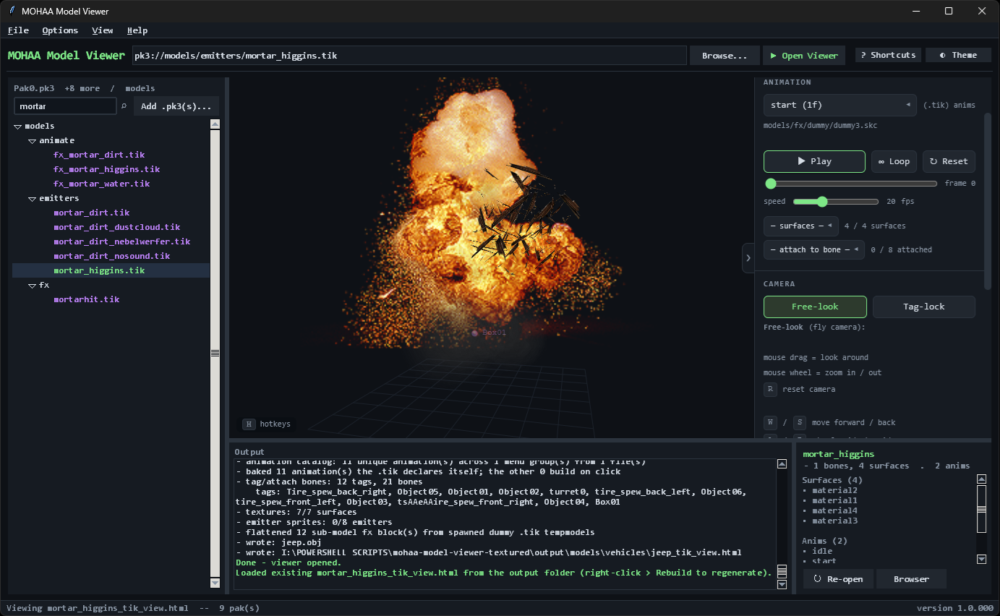
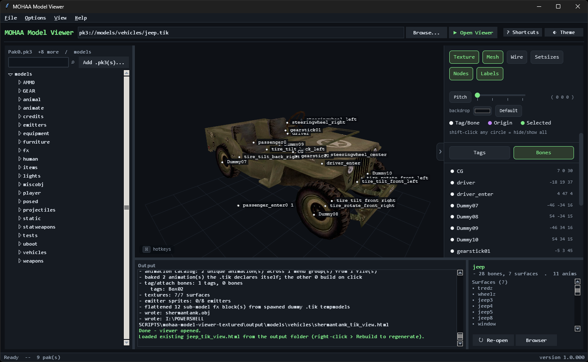
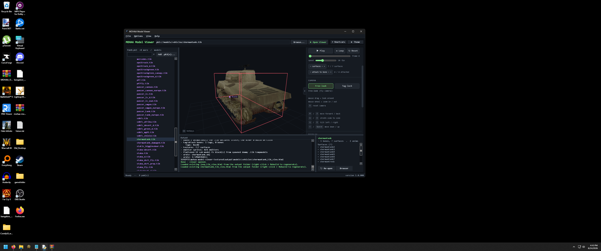
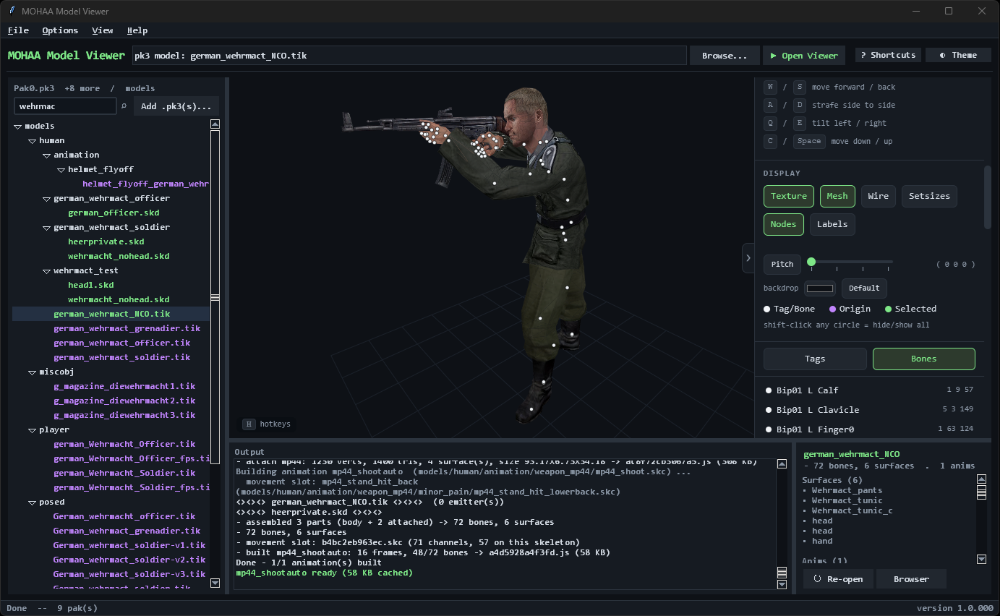
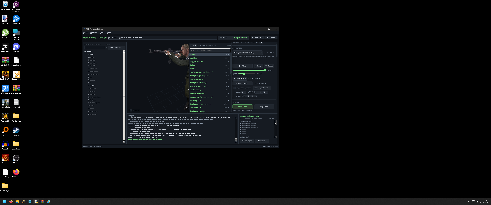
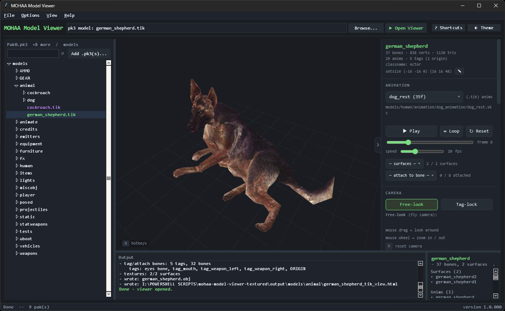
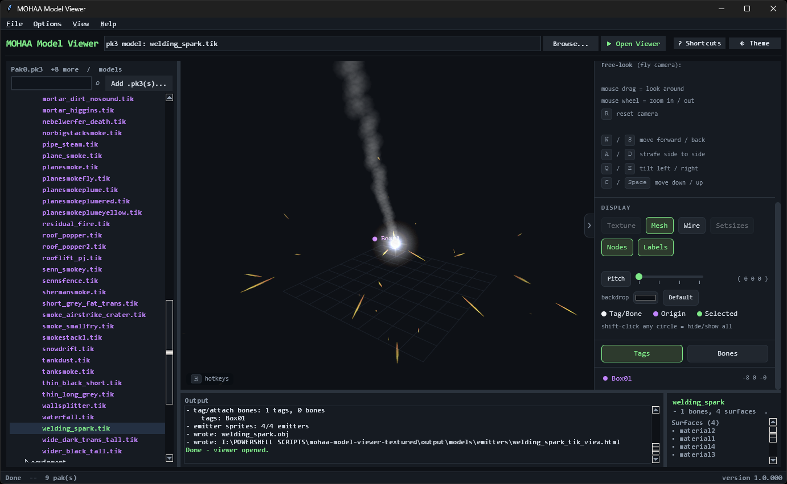

# MOHAA Model Viewer

A browser-based 3D asset viewer for *Medal of Honor: Allied Assault (2002)*, aiming at
exact in-game visual parity across every asset type the engine ships: skeletal
models, animations, vehicles, weapons, projectiles, static props, and the
particle emitters and FX effects that existing tools do not handle.
#### [Jump to: Install instructions](#install)<br>

Load your `.pk3` archives, browse the model tree, and open any `.skd` or `.tik`
in a self-contained HTML viewer with animation playback, tag display, texture
resolution through the shader chain, and live particle effects.



## Why this exists

Plenty of tools open MOHAA's static geometry — vehicles, weapons and props load
fine in LightRay3D or Milkshape 3D. None of them show you a *running* asset: the
particle emitters, the FX scripts, the explosions, a skeletal model actually
playing its animation with its effects firing on the right frames. This viewer
does, rebuilding each effect from the `.tik` / `.shader` commands the way the
engine would, so what you see on screen is what the game draws.

## Features

[See screenshots below](#screenshots)

**Loading & browsing**

* Open one or more `.pk3` archives and navigate the `models/` tree, or drag a
  loose `.skd` / `.tik` onto the launcher (or onto the RUN `.bat`).
* Loaded paks and preferences are remembered between sessions, with a
  recent-files list, tree search (`Ctrl+F`) and Explorer-style keyboard
  navigation.
* Select several files to build them in one batch, or drag a file out of the
  window to open it in its own browser tab.
* Right-click a file to open a `.tik` in your text editor, or a `.skd` in
  LightRay3D / Milkshape 3D (set them under Options → Change Text Editor /
  Change Legacy Model Viewer).
* Every built model is also exported as a Wavefront `.obj` you can open in other 3D tools.

**Rendering & animation**

* Skeletal `.skd` / `.skb` models with textures resolved through the full
  `.shader` chain, plus `.skc` / `.tik` animation playback — play/pause, loop,
  reset, per-frame scrub and a speed control.
* The animation browser follows the model's own `$include` / `includes{}`
  structure, so you can reach every anim the asset can play. The first 150 are
  built into the page (adjustable in Options); the rest are built the first time
  you pick them.
* **Particle emitters, FX scripts and explosions**, rebuilt from the effect
  commands and fired on their real frames — the part other tools skip.
* Show or hide individual surfaces, starting from what the `.tik` hides at spawn;
  an animation's own surface commands apply as it plays.
* Hang other models off any bone or tag with **attach-to-bone**, each with its
  own editable scale, offset (in `.tik` units) and angles.
* WebGL rendering with a real depth buffer, or the 2D-canvas renderer (switch with
  View → Viewer renderer in the launcher, or Display → WebGL in the viewer; 2D is used
  automatically when WebGL isn't available).

On-demand animations and attach-to-bone need the launcher's embedded pane; a page
opened in a plain browser shows everything already built into it.

**Inspect & tweak**

* Display toggles: Texture, Mesh, Wire, Setsizes, Nodes, Labels, Face Anims,
  Corona orbit, WebGL and, for trees, the long-range Tree Sprite stand-in.
* **Edit a model's `setsize` bounding box live** — a pencil toggle on the setsize
  line turns the two `( x y z )` triples into number fields that redraw the red
  box as you type, then revert to the file's original values when you toggle it
  back off. A model with no `setsize` shows a `( 0 0 0 ) ( 0 0 0 )` placeholder
  you can fill in the same way.
* Copy the `setsize` line, or any attach-to-bone `scale / offset / angles` row,
  as one flat line in MOHAA `.tik` spacing — ready to paste straight into a
  script.
* Free-look (WASD fly) and Tag-lock (orbit a clicked tag) cameras; tag/bone nodes
  and labels with a Tags-vs-Bones filter.
* An entity placement-angle (pitch / yaw / roll) dial that snaps to quarter
  turns, with a pencil for typing any angle.
* Light / dark theme and a custom backdrop colour, plus a full keyboard-shortcut
  set (`H` in the viewer, `F1` in the launcher).

**Self-contained by design**

* Each generated page is a single `.html` file — textures embedded as `data:`
  URIs, a restrictive Content-Security-Policy, and no network access at all
  (see [Privacy](#privacy) and [Security](#security)).

---

## Requirements

* **Python 3.8 or newer** (3.11+ recommended), with the `tkinter` GUI module.
* **Pillow 10.3 or newer** — required; MOHAA textures are `.tga` and nothing else
  decodes them. (Pillow 10.3 is also why Python 3.8 is the minimum.)
* Your own legally obtained copy of the game, for its `.pk3` files.
* Optional, Windows only: an embedded 3D pane instead of a browser tab
  (`pythonnet`, `pywebview==4.4.1`, `tkwebview2` and the Microsoft Edge WebView2
  Runtime, which ships with Windows 10/11).

The packages are listed in [`docs/requirements.txt`](docs/requirements.txt). On
Windows, the RUN `.bat` checks for all of these and installs what's missing.

## Install

### Windows

* Click the green `<> Code` button and choose `Download ZIP`. <br>
Extract the `mohaa-model-viewer-main` folder anywhere on your PC.

* Start the program with **`RUN -- Medal of Honor Model Viewer.bat`**, or drag a
`.skd` / `.tik` onto it. Before opening the launcher it:
  1. looks for **Python 3.8 or newer with tkinter**. If there isn't one, it asks
     whether to install it now: **Y** runs `bin\python_installer_updater.bat` (below),
     **N** closes the window so you can install Python yourself from
     [python.org](https://www.python.org/downloads/) (tick "tcl/tk" in the installer);
  2. installs **Pillow** if it's missing (required for textures);
  3. installs the **embedded 3D pane** packages if they're missing (optional; on
     Windows 8.1 and newer);
  4. tells you if the Microsoft Edge WebView2 Runtime is missing, in which case
     models open in your browser. WebGL needs nothing extra.

  It then opens the launcher and its own window closes.

* **`bin\python_installer_updater.bat`** installs a Python that suits your Windows
version and CPU (Windows 7 → 3.8, Windows 8/8.1 → 3.11, Windows 10/11 → latest),
verifies the installer's Authenticode signature before running it, and installs
the packages. The RUN `.bat` offers to run it for you, and you can also run it on
its own to update the packages. <br>
It deliberately **does not modify your `PATH`** — Python's own installer handles
that, and hand-editing the registry `PATH` is how environments often get broken.

* If Windows blocks the `.bat` (SmartScreen or Smart App Control): <br>
Right-click the `.bat` file → Properties → General tab → Security: [✓] Unblock → OK.

* Once it's open, use File → `Add .pk3 pak(s)...` and select all the game's `.pk3`
files (Pak0.pk3 and up, plus any expansion or mod paks; later paks override
earlier ones). <br>
The models, animations, scripts and textures are spread across them, so load them
all together.

### macOS

```sh
brew install python-tk          # or use the python.org installer, which bundles Tk
pip3 install "Pillow>=10.3.0"
python3 bin/mohaa_launcher.py
```

### Linux

```sh
sudo apt install python3-tk     # Debian / Ubuntu / Mint
sudo dnf install python3-tkinter # Fedora / RHEL
sudo pacman -S tk               # Arch

pip3 install "Pillow>=10.3.0"
python3 bin/mohaa_launcher.py
```

The embedded 3D pane is Windows-only. Everywhere else, models open in your
default browser — same viewer, same output.

## Updating

**Help → Check for updates** compares your version with the latest one in this
repository and, if you choose, downloads the new version's files, copies them over the
program folder, and restarts. Your settings and built models in `output/` are left alone.

## Where your files go

| | |
|---|---|
| Settings & console log | the program's `output/` folder (next to `bin/`); in a flat / portable install, the scripts' own folder |
| Built viewers | your chosen output folder (default: `output/models/`, mirroring the pak's folders); files opened directly go to `output/standalone/` |
| Scratch space | a `mohaaview_*` folder in your system temp directory |

Built viewers and scratch files can be cleared from **File → Clear built models / Clear %temp% files**.

---

## Privacy

**This program collects nothing and sends nothing.** No telemetry, no analytics,
no crash reporting, and nothing is ever checked or sent automatically. Everything
happens on your machine.

The program uses the network only when you ask it to: **Help → Check for updates**
reads a small version file from this repository and, if you choose, downloads the
newer files from GitHub. (On Windows, the RUN `.bat` also installs missing Python
packages from pypi.org, and the Python installer it offers downloads Python from
python.org if you say yes.)

Full notice: [`PRIVACY.md`](docs/PRIVACY.md), or **Help → Privacy & Legal** inside the
program.

## Security

`.pk3` files are ordinary ZIP archives, and downloaded ones should be treated as
untrusted input. The program is hardened accordingly — archive paths are confined
to its workspace, model headers are bounds-checked, parsers are protected against
decompression and expansion bombs, and generated pages escape game-file text and
carry a restrictive Content-Security-Policy.

Found a hole? See [`SECURITY.md`](docs/SECURITY.md). **Please report privately, not in
a public issue**, and please don't attach copyrighted game assets to reports.

## Licence

Released under the **GNU General Public License v2** — see [`LICENSE`](LICENSE).

Engine behaviour is verified against [OpenMoHAA](https://github.com/openmoh/openmohaa),
which is GPLv2. [`THIRD_PARTY_NOTICES.md`](docs/THIRD_PARTY_NOTICES.md) explains that
relationship and lists every dependency's licence.

## Legal

*Medal of Honor* and *Medal of Honor: Allied Assault* are trademarks of their
respective owners. This is an unofficial, non-commercial fan project. It is
**not affiliated with, authorised, sponsored or endorsed by Electronic Arts Inc.**
or any other rights holder. Those names are used only to identify the game whose
file formats this tool reads.

**No game assets are distributed with this project**, and none may be committed
to it. You must supply your own copy of the game. Do not redistribute extracted
game content.

## For developers

Project notes live in [`docs/changelog/`](docs/changelog/README.md): the
[changelog](docs/changelog/CHANGELOG.md), an
[architecture overview](docs/changelog/project-overview.md) with known issues,
the [development workflow](docs/changelog/development-workflow.md),
[engine notes](docs/changelog/engine-notes.md), and a reference of every
[emitter command](docs/changelog/emitter-commands.md) the viewer supports. The
source code cites the exact OpenMoHAA files and lines it follows.

## Contact

Bugs, questions and suggestions: [open an issue](https://github.com/searingwolfe/mohaa-model-viewer/issues).
Security problems: report privately as described in [`SECURITY.md`](docs/SECURITY.md).

## Credits

Made by **Searingwolfe**.

Engine reference: the [OpenMoHAA](https://github.com/openmoh/openmohaa) project. <br>
Without the game's raw code, matching the original renderer would not have been possible.

## Screenshots







